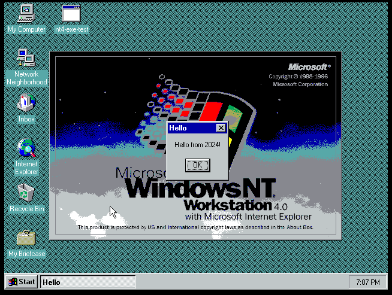

# nt4-exe-test

This is a sample project which compiles a C++ executable compatible with NT 4.0 from VS 2022 based on [work by Colin Finck](https://building.enlyze.com/posts/targeting-25-years-of-windows-with-visual-studio-2019/). I made it to verify I hadn't broken compatibility when updating EnlyzeWinCompatLib and its embedded libc++ fork.

---

